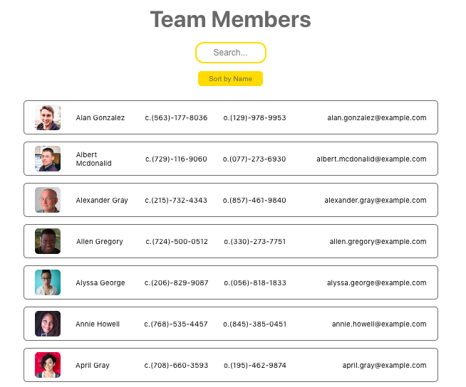

Employee Directory
===============

## Description 
This app allows access to a list of team members and their contact information. The list can be dynamically filtered when searching and sorted by team member name. 

## Installation
Once the repo has been forked, run `npm i` in the terminal to install dependencies. The app is started with `npm start`.

## Usage 
The app automatically loads information on 100 people from the [Random User API](https://randomuser.me/). They can then be dynamically filtered by typing in search terms or sorted ascending or descending alphabetically by clicking on the button.

## Credits
This project was my first attempt to use [React](https://reactjs.org/) to build an app, so it is a simple project with no backend. 

## License
MIT
